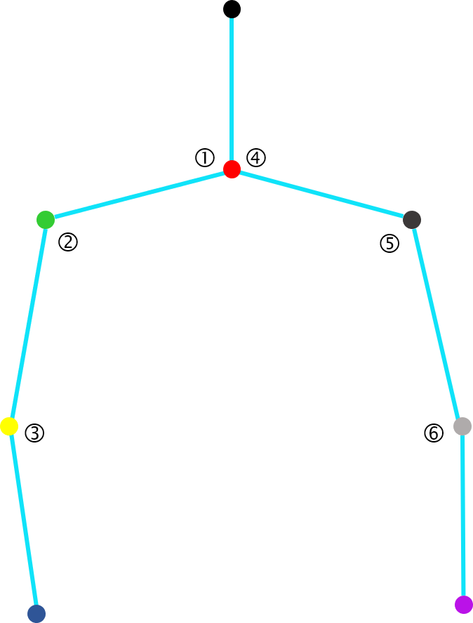

# **Body Pose Estimation - Android**

Copyright (C) 2019 여름방학에는 인턴해야지

## Featrues

Body Pose Estimation을 이용하여 Android에서 포즈 매칭을 수행합니다.

- **경량화 모델**. 경량화된 Tensorflow Lite 모델로 휴대폰에서 가볍게 사용할 수 있습니다.
- **포즈 매칭**. 각 조인트의 각도를 계산하여 포즈매칭을 수행합니다.
- **포드 등록**. 매칭 시킬 포즈를 등록합니다.

## Screenshots

***포즈 매칭***


## Requirements

- Android Studio 3.1.x
- Gradle 3.1.x
- Android Support Library, revision 21 or newer

## Algorithm

### 포즈 매칭

입력된 상반신의 6개 edge들의  Angle을 추출하여 매칭시킬 skeleton의 Angle과 정확도를 측정한다.



**각도 계산**

```java
private double getAngle(float[][] resultArr, int index) {
        List<Integer> basePoints = BASE_ANGLE_LIST.get(index).getPoints();
        double thetaA, thetaB, thetaC;
        double temp, Angle;
        thetaA = Math.sqrt(Math.pow(resultArr[basePoints.get(0)][1] - resultArr[basePoints.get(2)][1], 2) +
                Math.pow(resultArr[basePoints.get(0)][0] - resultArr[basePoints.get(2)][0], 2));
        thetaB = Math.sqrt(Math.pow(resultArr[basePoints.get(0)][1] - resultArr[basePoints.get(1)][1], 2) +
                Math.pow(resultArr[basePoints.get(0)][0] - resultArr[basePoints.get(1)][0], 2));
        thetaC = Math.sqrt(Math.pow(resultArr[basePoints.get(1)][1] - resultArr[basePoints.get(2)][1], 2) +
                Math.pow(resultArr[basePoints.get(1)][0] - resultArr[basePoints.get(2)][0], 2));

        temp = (Math.pow(thetaB, 2) + Math.pow(thetaC, 2) - Math.pow(thetaA, 2)) / (2 * thetaB * thetaC);
        Angle = Math.acos(temp);
        Angle = Angle * (180.0 / Math.PI);
        return Angle;
    }
```

**정확도 계산**

```java
private double getPersentage(double compareNumber, double betweenAngle) {
        return (((HALF_DEGREE - Math.abs(betweenAngle - compareNumber))) / HALF_DEGREE) * 100;
    }
```

## Contribution

1. Fork it (http://github.com/koomg9599/BodyPoseEstimationAndroidt)
2. Create your feature branch (git checkout -b feature/fooBar)
3. Commit your changes (git commit -am 'Add some fooBar')
4. Push to the branch (git push origin feature/fooBar)
5. Create a new Pull Request

## Reference

[https://www.tensorflow.org/lite/models/pose_estimation/overview](https://www.tensorflow.org/lite/models/pose_estimation/overview)

## License

[Apache License 2.0](https://github.com/edvardHua/PoseEstimationForMobile/blob/master/LICENSE)
